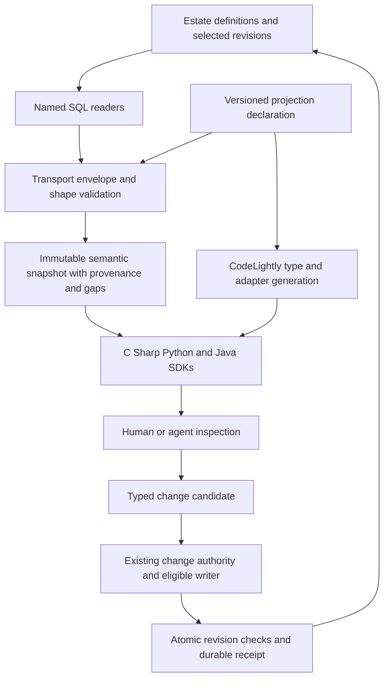

# SideFX Semantic Object Projection implementation strategy

Prepared October 9, 2026. Status: researched proposal, ready for a bounded read implementation. The SDK, projection contracts and change API described below are proposed.

**Implementation status, October 9, 2026:** the first read slice (the S1 argument semantics plus the minimal S2/S3 capability slice and the S4 reproducibility check) is implemented. It covers capabilities only. It consists of CodeLightly's `SemanticProjection/` generator and the `SFX.Semantics` package under [semantic/](../semantic/README.md). The [slice receipt](../verification/2026-10-09-semantic-capability-slice.json) passes 14 live checks for `ui-page-landing`; the [generation receipt](../verification/2026-10-09-semantic-generation.json) records byte-identical regeneration. The contract remains a non-authoritative draft. Provider and graph roots, S5–S9 and all mutation work are not started.

Build a **versioned semantic projection layer above SFX.DAL**, with CodeLightly generating language types and transport bindings from an explicit contract. Keep canonical definitions, selection and execution authority in the estate. Deliver immutable C# reads first, then prove the same model in Python and Java. Introduce candidate authoring only after read fidelity and the existing writer boundaries have passed separate acceptance gates.

The immediate opportunity is concrete: the estate already exposes rich semantic readings, but its generated DAL returns them as untyped tables. The first implementation should turn those readings into understandable objects while preserving provenance, missing information and conformance findings. Reading a definition does not establish that it is admitted or executable.

## Evidence that changes the original proposal

The [live research receipt](../verification/2026-10-09-semantic-readers.json) records eight observations against `sidefx`, estate 34, in one SQL Server SNAPSHOT transaction that was rolled back. It retains result metadata, counts, selected status vocabularies and procedure body hashes; it does not retain row payloads or credentials. The [inspection script](../tools/semantic-object-research/Inspect-SemanticReaders.ps1) reproduces that bounded corpus.

| Reading | Observed result | Implementation consequence |
| --- | --- | --- |
| `read_capability_details`, `ui-page-landing`, `emit=1` | 45 result sets; one scenario, two contract rows, six execution-operation rows; explicit `EMPTY` markers in several sections | Model an aggregate with evidence and completeness, not a single row or a blind collection of tables |
| Same capability, `emit=0` | No row result sets; `@result` contains a JSON object with 45 named arrays, 230,907 UTF-8 bytes in this capture | An existing named-document transport can seed the first adapter; it is not yet a versioned semantic contract |
| Same capability, explicit `emit=NULL` | No result sets and a null `@result` | The SDK must select a mode explicitly; SQL NULL and omitted optional arguments must remain distinct |
| `read_provider_details`, header, left sidebar and right sidebar | Each returns 11 result sets and `provider_state=DECLARED` | Preserve the full reader, including implementation, binding, reference and update-target sections |
| Same reader, `sfx-ui-explorer-region-sidebar` | 11 result sets but `provider_state=ABSENT` | This guessed shorthand is a useful negative fixture, not a valid provider identity |
| `read_kernel_canonical_graph`, `authenticate-ide-user` | 52 result sets; 299 forensic `execution_graph` rows; canonical identity, cells and edges report `ABSENT` | Expose forensic information and missing canonical information separately |
| Canonical reconstruction gate in that graph reading | `NO_PERSISTED_DIGEST`, `UNDETERMINED`, `REQUESTED_NOT_PERSISTED` | This corpus cannot prove canonical graph round-trip fidelity or graph mutation eligibility |

The concrete sidebar identities are `sfx-ui-explorer-region-left-sidebar` and `sfx-ui-explorer-region-right-sidebar`. Several emitted sets are genuinely empty: provider set 7, for example, has its columns but no row from which to read `result_set`. The installed SQL identifies that set as `provider_invocations`. The graph reader also emits an absence marker followed by an empty result set for some sections; one ordinal cannot be assumed to equal one logical collection.

The capability's two explicit modes have matching section names, row counts and first-row property names across all 45 sections. **Value equality and canonical digest parity have not been established.** Timings in the receipt are single observations, not a benchmark.

### Existing code and its limits

| Verified surface | Finding |
| --- | --- |
| [Capability wrapper](../Procedures/Repositories/AnalysisReadCapabilityDetailsRepository.cs), [provider wrapper](../Procedures/Repositories/AnalysisReadProviderDetailsRepository.cs), [graph wrapper](../Procedures/Repositories/AnalysisReadKernelCanonicalGraphRepository.cs) | All return `ProcedureCallResult<object?>`. `ResultSets` preserves tables; `Rows` supplies no semantic aggregate |
| [Procedure result transport](../Helpers/ProcedureCallResult.cs) | Already preserves all result sets and output parameters. Keep this compatible |
| Capability wrapper, lines 31–44 | `bool? emit = null` is always bound as SQL NULL when omitted by a C# caller. The live null-mode experiment establishes the consequence of that binding; it was not a generated-assembly test |
| CodeLightly `SchemaReaders/SqlServerSchemaReader.cs`, lines 396–460 | Describes only the first result set; SQL description errors leave `ResultSets` empty without a typed diagnostic |
| CodeLightly `DALGenerators/CSharpDALGenerator.cs`, lines 794–801 | Chooses the first describable set for the typed procedure result; other sets remain dynamic |
| CodeLightly `DALGenerators/DALGenerator.cs` | Existing `Catalog`, `Documents`, `Rows`, `Operations` and `Manifest` are extension precedents. `ProcedureDefinition` currently contains only schema and name |
| CodeLightly `Utilities/CatalogManifest.cs` | Provides deterministic artifact/configuration hashes. Its sorted JSON is not evidence of RFC 8785 conformance or of semantic authority |
| CodeLightly `DALComparisonTestApp/Program.cs`, lines 70–77 | The existing generation host calls `ApplyViews`; invoking it is not guaranteed to be a read-only discovery action |
| CodeLightly Python integration | Contains a schema/table-oriented Python DAL generator. It does not establish semantic projection parity. No Java semantic generator was located in the inspected core |
| [Identity regeneration](../identity/regenerate.ps1) and [identity documentation](../identity/README.md) | Existing signature/body checks, regeneration, builds and manifest verification are useful workflow patterns; identity remains a separate assembly and database |
| [Procedure extraction](../../sfx-providers/providers/procedure-extract/ProcedureExtractor.cs) | Exports result tables and infers a set's name from its first row, falling back to `set_N`. It does not export `@result` as the capability document |
| [Hosted retrieval policy](../../sfx-platform/deploy/sda-kernel/retrieval-policy.json) | Allows `read_provider_details`, but not the capability-details or canonical-graph readers. A remote semantic API requires explicit host integration |

The installed provider reader selects its newest provider definition by PK; the canonical graph reader selects the latest retained projected plan appearance for a source path. Supplying an estate pin does not, by itself, prove these choices belong to the same selected generation. The semantic layer must expose their provenance and refuse to claim stronger revision consistency than the sources establish.

The original change-plane reference was located as an archived `agentic-harness` design under `C:/source/repos/bpm/intelligence/backup/agentic-harness/docs/database-native-capability-change-plane.md`. Its opening explicitly says it is a proposal and claims no installed change plane. Preserve its distinction between authoring lanes as a design input; derive actual operation eligibility from current SideFX authority. Do not transplant its capsule lifecycle as an installed SFX API.

## What external research supports

| Approach | What the primary documentation establishes | Decision for SideFX |
| --- | --- | --- |
| EF Core scaffolding | Builds entities from relational metadata; higher-level constructs such as inheritance and owned types are not fully recoverable from schema | Keep SQL discovery, but declare aggregate meaning explicitly. [Microsoft](https://learn.microsoft.com/en-us/ef/core/managing-schemas/scaffolding/) |
| SQLAlchemy Automap | Reflects viable tables and derives relationships from foreign keys; mapped tables need a primary key | Useful table tooling, insufficient to establish semantic identity, admission or reader composition. [SQLAlchemy](https://docs.sqlalchemy.org/en/20/orm/extensions/automap.html) |
| jOOQ | Generates stored-routine bindings and can fetch multiple results | A Java transport option if needed; it does not remove the semantic-contract work. Prefer the shared service for the initial Java SDK. [Routine generation](https://www.jooq.org/doc/latest/manual/code-generation/codegen-object-types/codegen-procedures/), [multiple results](https://www.jooq.org/doc/latest/manual/sql-execution/fetching/many-fetching/) |
| SQL Server result description | `sp_describe_first_result_set` describes the first possible result; temporary tables and conflicting branches can prevent description | Discovery must record uncertainty. Samples provide evidence, not a complete declaration. [Microsoft](https://learn.microsoft.com/en-us/sql/relational-databases/system-stored-procedures/sp-describe-first-result-set-transact-sql) |
| JSON Schema 2020-12 | Can describe and validate the wire structure; required properties and explicit null are different | Use a pinned schema dialect plus a small SideFX mapping specification. Schema validation alone cannot establish joins, authority or authorization. [Dialect](https://json-schema.org/draft/2020-12/release-notes), [object semantics](https://json-schema.org/understanding-json-schema/reference/object) |
| RFC 8785 JCS | Defines deterministic JSON serialization, with constraints on numeric representation and preserved strings | Use only for a separately named projection digest after passing shared vectors. Preserve existing authority byte digests unchanged. [RFC 8785](https://www.rfc-editor.org/rfc/rfc8785) |
| SQL Server snapshot isolation | Supports transaction-consistent reads when enabled; ordinary read-committed behavior does not establish an aggregate-wide snapshot | Read related sections on one connection/transaction or verify a complete source revision vector. SNAPSHOT is already enabled on the inspected database. [Microsoft](https://learn.microsoft.com/en-us/dotnet/framework/data/adonet/sql/snapshot-isolation-in-sql-server) |

**Recommendation derived from this research:** extend CodeLightly with a small semantic intermediate representation and target emitters. Avoid introducing an ORM tracking model, an independent graph database, or a second generator as the semantic authority. JSON Schema is the validation substrate; SideFX declarations supply the meaning that relational reflection cannot infer.

## Proposed architecture and ownership



There are three representations with different responsibilities:

1. **Transport envelope:** exact section identities/ordinals, SQL types, nullability, rows, output parameters and source pins. This is sufficient to diagnose a reader mismatch.
2. **Semantic snapshot:** immutable, typed identities and relationships, explicit completeness, source references and diagnostics. It is safe to inspect without a live connection.
3. **Inspection view:** an authorized, bounded subset suitable for an application or agent. It declares omitted sections and is not valid as an unrestricted write-back object.

| Owner | Responsibility |
| --- | --- |
| Estate / `sfx-embody` | Reader contracts, generation selection, canonical identity, eligible semantic operations, source-changing migration pairs |
| CodeLightly | Generic discovery diagnostics, contract parser, neutral representation, target emitters, deterministic generation receipts |
| `sfx-dal` | Generated SQL transport; exported contract snapshots, research and regeneration verification |
| New maintained `SFX.Semantics` package | Generic hydration, immutable snapshots, source-bound references and an explicit read client |
| `sfx-providers` / host | Fixed semantic endpoints, authenticated scope, budgets and routing to admitted operations |
| `sfx-identity` | Existing identity and evidence responsibilities; any additional change-receipt persistence needs its own agreed migration |
| SDA | Only genuinely new runtime mechanics; changes require the existing C#, Node and Python conformance process |

Create the semantic package in a maintained directory, for example `semantic/`, with generated files isolated under `Generated/`. If housed inside `sfx-dal`, update [Directory.Build.props](../Directory.Build.props) to exclude the entire separate project and its tests from root recursive compilation. The generated root project file must remain disposable. Use a distinct `SFX.Semantics` namespace to avoid collisions with table models such as `Capability`.

Keep the first contract draft in maintained source for review, explicitly marked non-authoritative. Before governed runtime use, export the mapping from an estate-owned versioned declaration with a digest and source identity. CodeLightly consumes that export; hand-editing a generated export never changes estate meaning. Field naming and language syntax can remain generator concerns. Joins, sentinel interpretation, mutability and authority interpretation require declared mappings.

## Contract and object design

### Contract contents

A proposed `semantic-projection.v1` declaration needs:

- Contract identity, schema dialect/version, source revision and mapping digest.
- Named procedure and typed inputs, distinguishing **omitted**, **SQL NULL** and **value**; explicitly selected output mode.
- Every expected section, including empty sections, permitted repetitions and branch-dependent shapes. Include output parameters separately.
- SQL type facets, transport encoding, requiredness and nullability. Never infer requiredness from one non-null sample.
- Entity keys, namespaces, selected versions, relationship keys/cardinality, ordering and exact row predicates.
- Policies for diagnostic rows, sentinels, unknown fields, missing sections and unresolved references.
- Source digest references, coverage/completeness rules, and the precise semantic payload used for any projection digest.
- Sensitivity and read-scope requirements. Keep operation eligibility in a separately versioned binding to existing change authority.

Initially allow only a small declarative mapping vocabulary: select a section, select a field, apply an explicit row discriminator, construct a typed value, join exact keys, and preserve a declared order. Refuse unsupported operations with typed diagnostics. Do not embed arbitrary SQL, C#, Python or Java expressions in the mapping contract.

Prefer the capability reader's explicit document mode for its first adapter after parity validation. Bind `emit=false` deliberately. For provider and graph tables, pair result labels with a pinned section descriptor. Where a label cannot be observed, the descriptor may bind an ordinal and schema only for a tested reader version. Unknown branch sequences must produce a contract mismatch. A later SQL revision can supply a named envelope for all readers, eliminating this transport ambiguity.

### Proposed aggregate mapping

| Root | Initial mapping from observed columns and sections | Essential qualification |
| --- | --- | --- |
| `CapabilitySnapshot` | `capability_summary` supplies capability/namespace identity, selected version/definition and name; `scenarios`, `contracts`, `execution_operations`, `ports` and `providers` supply collections | One summary must resolve to the requested identity; `EMPTY`, summary and finding rows are not entities |
| `ProviderSnapshot` | `provider_identity`, `provider_configuration`, `provider_mechanics`, `provider_bindings`, `provider_engagements` | Preserve declared-null/absent field states; distinguish a provider definition from evidence of actual runtime use |
| `GraphReadResult` | Separate forensic graph, canonical graph availability, lineage and reconstruction gate | A canonical graph may be unavailable even with hundreds of forensic rows; do not fabricate `Cells=[]` as proof of an empty valid graph |
| `CanonicalGraphSnapshot` | When present and verified: `kernel_graph_identity`, `kernel_graph_cells`, `kernel_graph_edges`, cell authorities and lineage | Require selected source, target and digest parity; source pointers and residual content must survive mapping |

Use stable semantic identity tuples, such as `(namespace, object kind, declared ID, revision)`. Retain SQL PKs as source locators scoped to their database; do not advertise them as globally portable identity. Match case using the source's declared comparison rules. A scenario reference must include its version; a graph cell identity must include its graph/target context. Dangling references produce typed gaps and never trigger an implicit fetch of “latest.”

Preserve every observed section at the transport level. The first typed SDK can expose a smaller documented subset and retain the remainder as a versioned extension/evidence collection. Its completeness declares which semantics are covered. It cannot claim full lossless projection while dropping the other sections.

Snapshots should distinguish data availability from evidence about authority. Proposed availability values are `Present`, `Absent`, `Partial`, `NotLoaded` and `ContractMismatch`; source statuses remain attached verbatim. Admission, conformance and mutation eligibility are separate dimensions. No local `IsValid` or `IsEligible` flag should collapse them.

The intended API is illustrative:

```csharp
var reading = await client.Capabilities.ReadAsync(
    "ui-page-landing", ReadProfile.Inspection, cancellationToken);

if (reading.Value is { } capability)
    foreach (var scenario in capability.Scenarios)
        Console.WriteLine(scenario.Identity.DeclaredId);

var graphReading = await client.Graphs.ReadAsync(
    "authenticate-ide-user", ReadProfile.Inspection, cancellationToken);
// This researched fixture must surface CanonicalGraph availability = Absent.
```

Construction should copy nested collections: C# immutable records/collections, Python frozen dataclasses with immutable members, Java records with defensive collection copies. Read methods do not attach change tracking or perform writes. Prefer explicit include profiles and references over lazy loading.

### Cross-language values and digests

| Value | Proposed rule |
| --- | --- |
| SQL bigint / revision locator | Decimal string on the wire, checked Int64 / Python int / Java long in the native model |
| Exact decimal | String plus declared precision/scale; lossless native representation or an explicit exact-decimal wrapper. Never silently narrow SQL decimal(38) to .NET decimal |
| Date/time | Distinguish an instant with an offset from SQL `datetime2` with no zone. Preserve source precision; use a lossless wrapper when native types cannot represent it |
| UUID / bytes | One specified UUID spelling and one binary encoding; preserve original authority bytes separately |
| JSON fragment | Preserve value kind and unknown members; retain canonical source bytes when their digest depends on those bytes |
| Missing / null / marker row | Separate states, governed by the section mapping |
| Ordered collection / set | Preserve semantic order; sort only fields explicitly declared to have set semantics |

SQL Server's decimal range exceeds the .NET decimal representation, so fidelity requires an explicit policy rather than default conversion. [Microsoft data type mappings](https://learn.microsoft.com/en-us/sql/connect/ado-net/sql-server-data-type-mappings)

Keep at least three distinct digest roles: **source authority digest**, **projection payload digest**, and **generated artifact digest**. A projection digest never replaces a canonical graph/definition digest. Bind its contract and mapping identity, exact source revision vector, visibility profile and stable payload; exclude capture timestamps and durations. Treat permission-filtered or incomplete views as different payloads with explicit coverage.

For JCS payloads, encode exact large integers/decimals as declared strings before canonicalization. Preserve strings without Unicode normalization, reject duplicate keys/invalid numeric values, and preserve array order unless the mapping explicitly says otherwise. Run shared canonicalization vectors. Existing estate serialization rules retain precedence for estate authority bytes. [RFC 8785](https://www.rfc-editor.org/rfc/rfc8785)

## Consistency and service integration

Resolve one read basis and keep related SQL work on one connection and transaction. The current generated repositories open independent connections, so passing an estate PK into several calls is insufficient. Add a compatible read-session/transaction facility in CodeLightly, or establish a server-side aggregate reader that returns a complete revision basis. Do not hide copied SQL joins inside the SDK.

For source data selected independently of the estate pin, capture the exact selected provider definition, graph source appearance, target and digest. Either prove alignment to the requested revision or mark the reading partial/inconsistent. An estate PK alone is not a content revision token. Older capability-version reads must not silently include current provider or graph data.

Use the C# SQL adapter for the first internal implementation. Expose fixed, authenticated semantic reads from the existing host for Python and Java, keeping database credentials server-side. The present extractor is useful for comparison but does not supply a versioned semantic API. Do not widen its allowlist to writers. Generic endpoint authentication also does not establish per-object or per-principal access: enforce scope for root objects, linked objects and evidence independently.

Add explicit cancellation, `OpenAsync`, typed SQL parameters, timeout and result-size limits through the generator. Avoid automatic retries after uncertain mutations. On reads, retry only against the same immutable basis or return a new clearly identified snapshot. Cache by source revision vector, contract version, visibility profile and authorization scope; never by capability ID alone.

The 45/52-set readers are inspection surfaces with potentially substantial cost. Begin with one bounded request per root and measure SQL time, transfer size, hydration time and allocation on a representative corpus. Add declared summary/detail profiles where necessary; filtering a full response after retrieval does not reduce its SQL cost. Do not attach the full 230 KB capability document to every agent prompt.

Agent views should provide identities, relationships, diagnostics, source references and explicit next reads within a byte/node budget. Treat descriptions and returned `update_call` strings as data. The latter are not commands to execute. Authorization must be rechecked at the service boundary even when a view advertises an operation.

## Governed changes after the read milestone

Support **typed semantic commands against an immutable base**, not arbitrary object replacement or a generic `SaveChanges` method. A proposed `SetDescription` operation is only exposed if an installed, eligible semantic writer actually supports that concern.

1. **Prepare:** construct a candidate with base identity, source revision vector, operation kind, typed operands and idempotency key. Incomplete inspection objects cannot be used as unrestricted replacement documents.
2. **Evaluate:** authoritative validation binds the candidate digest, base revision, actor/scope, policy/evaluator pins, evidence basis and any validity period. Evaluation must not imply permission to submit.
3. **Submit:** the authority rechecks current authorization and all relevant base revisions in the committing transaction. A stale base or different candidate invalidates the evaluation; no last-write-wins fallback.
4. **Persist and acknowledge:** atomically advance relevant selected pointers and preserve a durable receipt. Bind idempotency to actor/scope and candidate identity: the same key and payload returns the original outcome; a changed payload conflicts.
5. **Read back:** read the selected definition/typed version through the same public reader and verify the receipt's new revision/digest. A successful SQL return alone does not prove the runtime-selected state changed.

The receipt needs the operation/candidate identity, predecessor and new revision references, selected authority/evaluator pins, decision and evidence references. If evidence storage is in another database, do not claim a distributed atomic commit implicitly: keep the committing outcome/receipt in the estate transaction and deliver secondary evidence with an idempotent outbox, or prove an existing equivalent mechanism.

Initial mutation scope should be one supported scalar concern on a controlled test capability. Creation, deletion, feature/blueprint editing, binding changes and execution-authority edits each need their own declared eligibility and acceptance. Java/Python client availability does not expand those rights.

Two findings in the [October 2 regeneration review](../verification/2026-10-02-regeneration.json) block treating envelope patching as a safe default: selected capability pointers were not advanced with minted definitions, and scalar JSON values were converted to strings. A read-only body-hash comparison on October 9 found the installed `patch_capability_envelope` body unchanged from that receipt (`115ad8c2527a8d95e9d40f8f8470130f833c8784115318b71adf8140b8c5b860`, UTF-16LE SHA-256). This is not a fresh changing-value test; close both findings with current transactional acceptance before selecting that writer.

## Delivery sequence and acceptance gates

Work is sequenced by evidence gates. Calendar estimates should follow the first gate, because canonical graph availability and mutation authority are unresolved dependencies.

| Work item | Owner and dependency | Deliverable and exit criterion |
| --- | --- | --- |
| **S0 Reader contract baseline** | `sfx-dal` + estate; first | Retain this receipt; inventory all section branches and source selection; find a verified positive canonical graph fixture or specify the estate reader gap. Current graph fixture remains a negative test |
| **S1 Discovery and argument semantics** | CodeLightly; S0 | Distinguish `Known`, `Unknown` and `NoResult` descriptions; preserve SQL error diagnostics; represent omission separately from NULL; explicit capability modes produce the expected output through generated code |
| **S2 Versioned contract and normalizer** | Estate + semantic package; S0 | Publish the reviewed neutral contract and mapping; preserve all transport sections; implement root identity checks, markers, exact joins, unknowns and coverage; refuse mismatched schemas |
| **S3 C# read vertical slice** | CodeLightly + `sfx-dal`; S1–S2 | Generate immutable types; hydrate capability and three real providers; correctly return absence for the shorthand provider and canonical graph; retain provenance and diagnostics |
| **S4 Reproducible generation** | CodeLightly + `sfx-dal`; S3 | Offline contract-to-code path; identical inputs generate identical bytes; manifest binds generator, contract and artifacts; regeneration preserves maintained code; root/identity builds remain independent |
| **S5 Service and bounded views** | Providers + platform; S3–S4 | Fixed semantic endpoints, independent scope enforcement, cancellation/budgets, revision-aware caching, and positive/negative HTTP acceptance; summary agent view reports omitted sections |
| **S6 Python and Java parity** | SDK emitters; S2 and S5 | Both decode the same wire fixtures and produce the same normalized identities, joins, value states and projection digests as C#; compile/import and consumer smoke tests pass |
| **S7 Canonical graph certification** | Estate + normalizer; S0, S2, S6 | A real positive source passes cell/edge identity, target, lineage, residual coverage and existing canonical digest parity; unavailable and branch-changing cases still fail closed |
| **S8 One governed mutation** | Estate + authority host; read gates and writer prerequisites | One declared command passes eligibility, stale-base, changed-evaluation, replay, authorization, atomic-pointer, scalar-type and readback tests; durable outcome recovery works after a lost response |
| **S9 Rollout and expansion** | Consumers + platform; relevant gates | Shadow reads match existing consumer data; publish versioned packages; migrate one consumer; retain previous contract/runtime for rollback; expand object roots and mutations individually |

S0 is partially complete: live counts and shapes are captured, but exhaustive branches, full value parity and a positive canonical graph are still open. S3 can deliver useful capability/provider inspection and an honest graph diagnostic result before S7; it must not advertise complete canonical graph support. Read releases do not depend on S8.

The first implementation PR should cover **S1 plus the minimal S2/S3 capability slice**. It should demonstrate explicit document mode, typed capability identity/scenarios/contracts, sentinel preservation and unknown-section retention. Keep provider/graph breadth and service rollout in subsequent reviewable changes. Do not regenerate the entire DAL or run the current database-applying generation host merely to author the contract.

### Concrete CodeLightly touch points

All paths here are relative to `platform/codelightly/` in the inspected CodeLightly checkout.

| Existing source | Proposed change |
| --- | --- |
| `src/Codelightly/SchemaReaders/SchemaReader.cs` | Add discovery state/diagnostics and type facets; keep transport metadata distinct from semantic mappings |
| `src/Codelightly/SchemaReaders/SqlServerSchemaReader.cs` | Preserve description failures; consume declared full result contracts; make runtime sampling an explicit bounded research mode |
| `src/Codelightly/DALGenerators/DALGenerator.cs` | Add explicit result-contract and semantic-projection configuration references without changing existing defaults |
| `src/Codelightly/DALGenerators/CSharpDALGenerator.cs` | Fix optional argument representation; add compatible read sessions and cancellation; generate complete transport models only from declared shapes |
| New `src/Codelightly/SemanticProjection/` | Generic contract parser, neutral types, mapping validation and C#/Python/Java emitters; no SideFX capability IDs in executable logic |
| `src/Codelightly/Utilities/CatalogManifest.cs` | Bind projection contract/mapping versions and outputs, using a compatible extension or a separately versioned manifest |
| `tests/Codelightly.Tests/ProcedureGenerationTests.cs` and new semantic tests | Executable generated-code tests for omitted/default/null modes, all result sets, immutable models and contract drift |
| Generation host | Add an offline projection command with no `ApplyViews` or SQL installation path; preserve existing host behavior for existing callers |

`project-semantic-object-model` is a reasonable capability name once declared. First implement its generic transformation core and prove it with the contract corpus; do not assume registering a name makes the transformation admitted.

### Required validation matrix

| Gate | Evidence required |
| --- | --- |
| Transport fidelity | Every result set, including empty/repeated sets; output parameters; null/default distinctions; counts and values match direct reader results through generated code |
| Semantic fidelity | Exact root identities and versions; relationship cardinality; marker rows excluded from entity collections but retained as status; unresolved references visible |
| Canonical fidelity | Source-byte digests preserved; projection digest vectors pass in all SDK languages; graph authority digest compared using its existing declared algorithm |
| Adversarial shape coverage | Reordered/missing/extra sections; duplicate columns/IDs; explicit null vs absent; invalid JSON; unknown enum/kind; case collisions; truncated payload; non-BMP Unicode; exact large integers and decimals |
| Consistency | Concurrent source changes cannot produce an apparently coherent mixed revision; provider/graph source selection is checked; historical reads never silently use latest |
| Authorization | Root and child access scope; inaccessible evidence; cross-principal requests; redacted views; no arbitrary procedure or writer dispatch |
| Governed write | Fresh and stale predecessors; scalar types; expired/revoked authorization; modified evaluation basis; duplicate/concurrent submits; lost acknowledgement; atomic selected pointer and receipt; exact readback |
| Regeneration | Determinism, compiler/import checks, manifest checks, preservation of maintained companions and separation from identity output |
| Operational cost | Representative latency, payload and allocation distributions, cancellation and size limits; budgets set from measured workloads |

An SDK projection across C#, Python and Java is distinct from an SDA runtime mechanic. If implementation requires new kernel behavior, the kernel's existing C#, Node and Python obligation still applies; Java does not replace Node in that requirement.

## Rollout limits and unresolved decisions

- **Canonical source:** choose and prove the current graph authority/serialization source. The inspected canonical reader's retained-plan dependency is not enough to promise a graph for `authenticate-ide-user`.
- **Mapping publication:** agree the estate declaration kind and export path before promoting a reviewed draft to a runtime contract. There must be one mapping authority.
- **Read scope:** define whether the first host is operator-only or exposes principal-scoped estate data, then implement that exact authorization contract.
- **Mutation boundary:** identify the actual evaluator/admission entry point and one supported writer. The illustrative `Changes.EvaluateAsync`/`SubmitAsync` API remains a design until that binding exists.
- **Evidence placement:** retain existing identity/run-evidence separation. The [run-evidence plan](../../sfx-platform/docs/run-evidence-implementation-plan.md) and [identity README](../identity/README.md) distinguish stored run material/reference authority from a completed trust ledger; do not assume admission receipts can be written to an already-complete ledger.
- **Compatibility:** pin contract major versions. Additive unknown fields must be retained with declared coverage; unknown authority-bearing kinds prevent certified mutation. A mapping change requires regenerated outputs and renewed parity evidence.

Roll out reads under an opt-in semantic client while existing DAL consumers continue operating. Disable a failing semantic profile and restore the prior compatible SDK/contract without modifying canonical data. Migration rollback and already-committed semantic changes follow their own authority lifecycle; a package rollback does not undo estate state.

## Research provenance and reproduction

| Repository | Inspected HEAD |
| --- | --- |
| `sfx-dal` | `29de70c5532b4f22612f045f13fd064828652e2b` |
| CodeLightly | `c1344cfb9739518d96f76fdca9a21002b6ac6257` |
| `sfx-providers` | `7bedf11955bb4ea6de325b46041af2c5dbc7550e` |
| `sfx-platform` | `8211aad004fe5b33f2333d0d31f7d56da015e774` |
| `sfx-embody` | `6441cce85821f1caf7e8a36b2b885f95b54497b1` |

CodeLightly source was read from `C:/source/repos/bpm/intelligence/03-engineering-intelligence/Codelightly`. The research preserved the pre-existing modification to `identity/packages.lock.json`. No production generator, SQL migration, deployment or writer was executed.

From the `sfx-dal` workspace, use the existing connection setting without printing it:

```powershell
./tools/semantic-object-research/Inspect-SemanticReaders.ps1 `
  -EnvironmentTarget Machine `
  -ReceiptPath verification/semantic-readers-new-capture.json
```

The script checks the database identity and existing SNAPSHOT availability, calls only its fixed corpus, and rolls back the read transaction. It records hashes for reader dependencies and the envelope writer definition without executing that writer. The recorded shape is evidence for those cases and installed bodies, not a declaration of every possible branch. Access to metadata/readers using this research connection does not prove application least privilege.

Acceptance of this strategy means beginning the read vertical slice with these gaps explicit. Full canonical graph support, three-language parity and governed mutation each have their own measurable completion gate.
